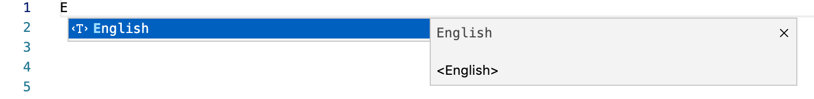
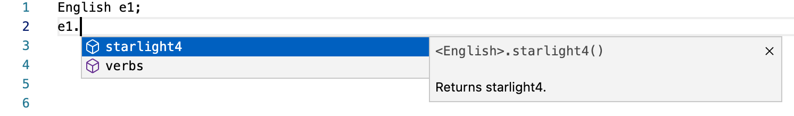
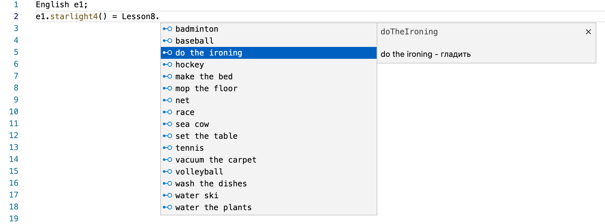
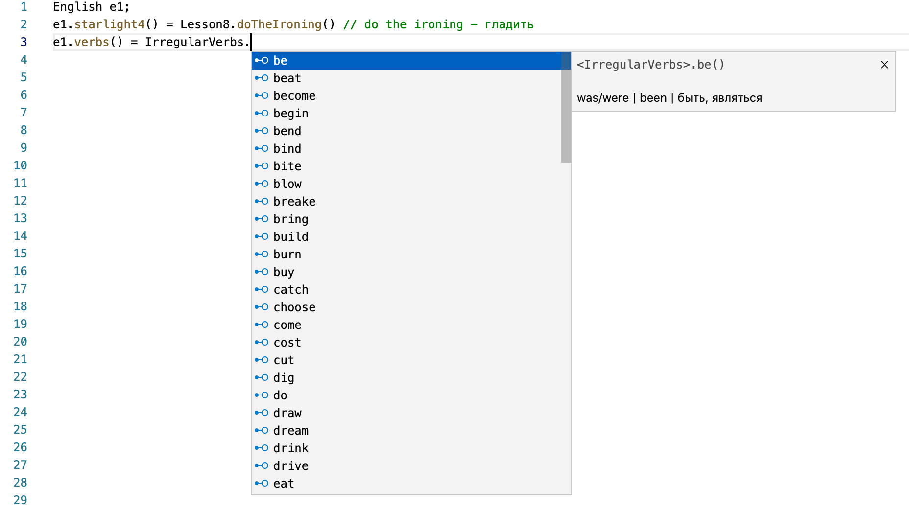

# Multi-Adviser Language for Visual Studio Code
Provides comprehensive MA Language support to [Visual Studio Code](https://code.visualstudio.com/), via the [vsmal](https://github.com/RubenAkhayan/vsmal).

Welcome! 👋🏻 

## Features
* Syntax highlighting
* Snippets

## Requirements
* VsCode 1.30.0 or more recent

## Installation

The recommended way to install VS-Multi-Adviser is via the [Visual Studio Marketplace](https://marketplace.visualstudio.com/items?itemName=RubenAkhayan.vsmal).

## Screenshots

